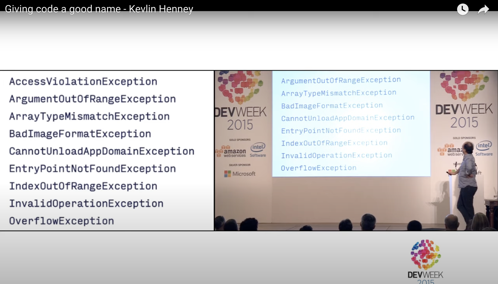
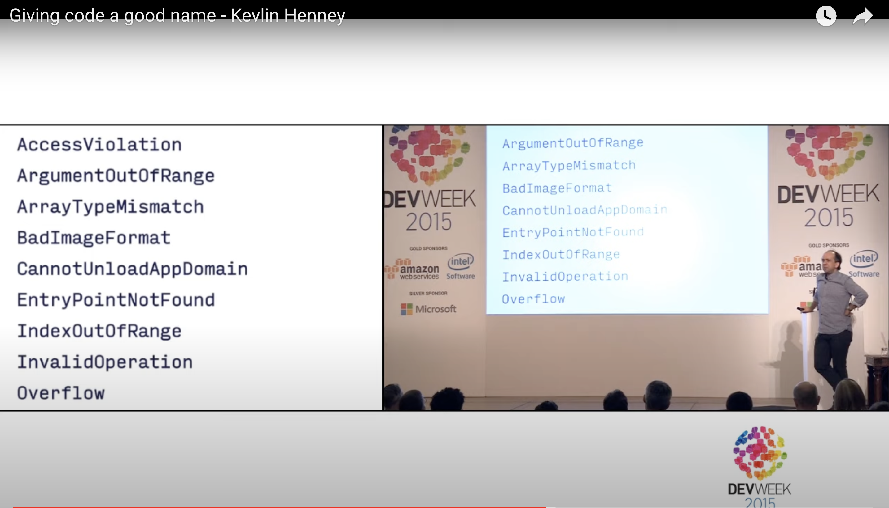

= Living Documentation
:author: Marc Bouvier • u.baldir.fr/me
:description: description
:version-label: v0.1
:date: {localdate}
:copyright: CC-BY-4.0
:revealjsdir: reveal.js
:revealjs_totalTime: 1800
:revealjs_hash: true
:revealjs_history: true
:customcss: css/presentation.css
:source-highlighter: highlightjs
:docinfo: private
:assetsdir: {docdir}/assets
:sectionsdir: {docdir}/sections
:title-slide-background-image: assets/hoken-landing.png
:title-slide-transition: zoom
:title-slide-transition-speed: fast
//:revealjs_theme: white
//:highlightjs-theme: reveal.js/plugin/highlight/a11y-light.css
:revealjs_theme: black
:highlightjs-theme: reveal.js/plugin/highlight/a11y-dark.css

Tu ne le sais pas encore, mais tu l'as deja documenté!

[.notes]
--
* Ouvrir les exemples
* Vérifier leur fonctionnement
* RevealJs shortcuts
** Alt+clic : Zoom in/ Zoom out
** O/Esc : Slide overview
** M : Menu
** ? : show keyboard shortcuts
** C : chalkboard overlay
** B : chalkboard modal
** D : Download chalkboard
** S : presenter mode
** V : Fade to black
** F: fullscreen -> Esc : exit fullscreen
--

include::thanks-agile-tour-strasbourg.adoc[]
include::sections/who_am_I.adoc[]

include::sections/ok_first_some_questions.adoc[]

[background-color="#051746"]
== Agenda

. The Story of an onboarding
. Living Documentation FTW
. A s**t ton of examples!
. Some Takeaways

include::sections/r_bad_onboarding.adoc[]

include::sections/the_problem_with_traditional_documentation.adoc[]

include::sections/internal_doc.adoc[]
include::sections/ok_already_there.adoc[]
include::sections/new_documentation_approaches.adoc[]

include::sections/ok_interlude_01.adoc[]
include::sections/examples_please.adoc[]

include::sections/ex_wiki_as_code.adoc[]

include::sections/ok_diagram_as_code.adoc[]

== Source Code Itself

=== Conventions, Idioms

== Redundant information in naming

=== Reduce useless noise

Repeated informations

[.medium]
--
[source,Java]
----
package org.mycompany.worlddestroyer;
/**
* The implementation of the Death Star. <1>
* @author Joe@empire.org <2>
*/
public class DeathStarImpl // <3>
             implements DeathStarInterface // <4>
{}
----
<1> Tells nothing more than the class signature
<2> In internal projet, maybe rely on version control history
<3> Of course it is an implementation
<4> Of course it is an interface
--

[.notes]
--
* `@author` does not encourage collective code ownership
--

[.columns]
=== Which is more readable?

[.column]
--

--

[.column]
--

--

[.refs]
--
* https://www.youtube.com/watch?v=CzJ94TMPcD8[Giving code a good name - Kevlin Henney]
--

=== Domain Driven Design

* Ubiquitous Language

== Test Code

== Tools to get insight from code

=== Word Cloud

Generate a word Cloud from your code

[%step]
* Do you see mainly domain related names?
* Or technical related names?

[.refs]
--
* https://www.jasondavies.com/wordcloud/
--

== Embedded learning

=== Good Example (annotation)

=== Bad Example

include::sections/ok_doctest.adoc[]
include::sections/ex_javadoc_code_snippets.adoc[]

include::sections/interlude_02.adoc[]

include::sections/ok_accessibility_audit_as_code.adoc[]
include::sections/ok_code_analysis.adoc[]
include::sections/ok_architecture_decisions_records.adoc[]
include::sections/ok_technology_radar.adoc[]
include::sections/ex_code_tour.adoc[]

include::sections/interlude_03.adoc[]

== Next are to be ordered

include::sections/interlude_04.adoc[]

// TODO: BDD and Features
// 3 amigos -> conversations / common language -> Collaborative
// Gherkin + Reconciliation mechanism -> Reliable
// Insightful -> may allow you to see your modules bounded contexts are not right
// Low-Effort -> Automation can generate accurate published documentation

// Conversations
include::sections/from_conversations.adoc[]

include::sections/ex_dsl.adoc[]
include::sections/ex_frontend_documentation.adoc[]

include::sections/ok_your_code_as_a_crimescene.adoc[]
include::sections/interlude_06.adoc[]
include::sections/ex_living_glossary.adoc[]

include::sections/ex_notebooks.adoc[]

include::sections/interlude_06.adoc[]

include::sections/ex_presentation_as_code.adoc[]
include::sections/ex_tests_as_documentation.adoc[]

include::sections/interlude_07.adoc[]

include::sections/ex_tools_history.adoc[]
include::sections/ex_vcs_based_documentation.adoc[]

include::sections/interlude_08.adoc[]

include::sections/ex_markdown_readme.adoc[]
include::sections/ex_declarative_infrastructure.adoc[]
include::sections/ok_docker-compose-to-diagram.adoc[]

include::sections/living_onboarding.adoc[]
include::sections/vcs_as_knowledge_source.adoc[]
include::sections/ok_your_tools_and_ide_features.adoc[]
include::sections/from_manual_to_automated.adoc[]

include::sections/ok_api_contracts_and_tests.adoc[]

include::takaways.adoc[]

include::sections/takaway_automation_has_a_cost.adoc[]

include::questions.adoc[]
include::ok_thanks_slides_infos.adoc[]