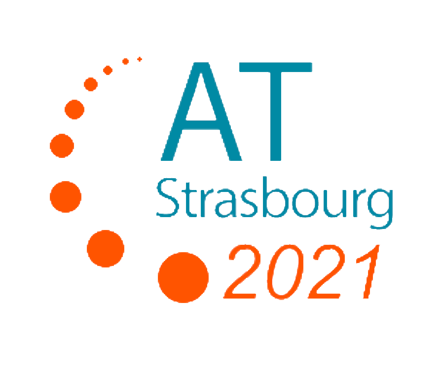
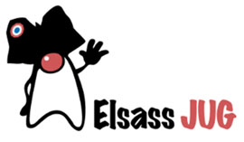
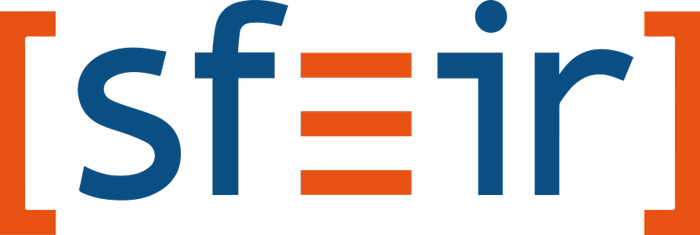
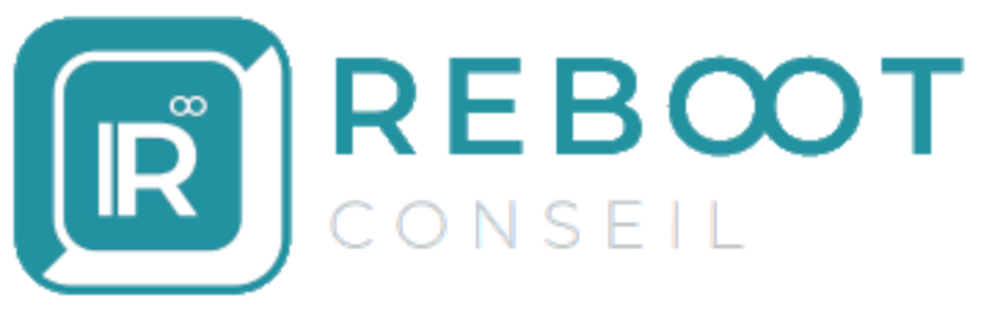

[background-color="#d9ffea"]
[.columns.is-vcentered]
== Thank You!

[.column]
--
[.agile-tour-strasbourg-logo2]

image::assets/agile-tour-strasbourg/agLy1l_j_400x400.jpeg[width="140"]
--

[.column]
--

image::assets/agile-tour-strasbourg/logoyggval.png[width="140"]

--

[.column.medium]
--

https://u.baldir.fr/me[u.baldir.fr/me]

image:assets/CC-BY_icon.svg[alt="CC-BY-4.0",width=120]

https://creativecommons.org/licenses/by/4.0/[CC-BY-4.0]
--

[.column.medium]
--
image::assets/qrcode_u.baldir.fr_AT2021LD.png[alt="QR Code vers le lien de la présentation",width=400]

https://u.baldir.fr/at-2021-ld[u.baldir.fr/at-2021-ld]

--

[.notes]
--
* CC-BY-4.0
** Free to
*** *Share* — copy and redistribute the material in any medium or format
*** *Adapt* — remix, transform, and build upon the material
for any purpose, even commercially.
** Under the following terms
*** *Attribution* — You must give appropriate credit, provide a link to the license, and indicate if changes were made. You may do so in any reasonable manner, but not in any way that suggests the licensor endorses you or your use.
*** *No additional restrictions* — You may not apply legal terms or technological measures that legally restrict others from doing anything the license permits.
--

[.refs]
--
* link:https://u.baldir.fr/at-2021-ld[Slides : u.baldir.fr/at-2021-ld]
* link:https://u.baldir.fr/at-2021-ld-src[Sources : u.baldir.fr/at-2021-ld-src]
* https://en.wikipedia.org/wiki/Creative_Commons_license#/media/File:CC-BY_icon.svg[Creative Commons "Attribution" license icon]
--