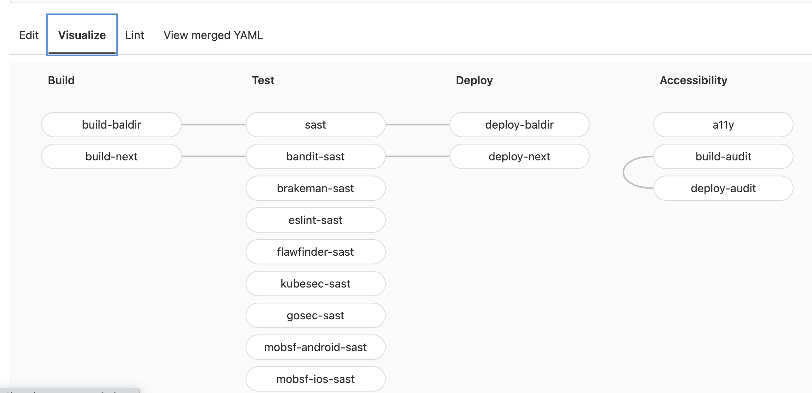

== Declarative infrastructure

=== Docker Compose

[.notes]
--
* docker-compose is a sort of documentation of infrastructure
* Azure infra as code
--

=== Gitlab CO file Input

[source,yml]
----
include:
  - template: "Verify/Accessibility.gitlab-ci.yml"
  - template: "Security/SAST.gitlab-ci.yml"
  - template: "Security/Dependency-Scanning.gitlab-ci.yml"
  - template: "Security/Secret-Detection.gitlab-ci.yml"

stages:
  - build
  - test
  - deploy
  - accessibility

build-baldir:
  stage: build
  script:
    - "echo do stuff"

deploy-baldir:
  needs:
    - "build-baldir"
  script:
    - "echo do stuff"

build-next:
  stage: build
  script:
    - "echo do stuff"

deploy-next:
  needs:
    - "build-next"
  script:
    - "echo do stuff"

build-audit:
  stage: accessibility
  script:
    - "echo do stuff"

deploy-audit:
  stage: accessibility
  script:
    - "echo do stuff"
----

=== Gitlab CI pipeline Vizualisation

[.refs]
--
* https://gitlab.com/marc-bouvier/baldir-fr/-/ci/editor?branch_name=master[CI/CD pipeline of my own site]
--