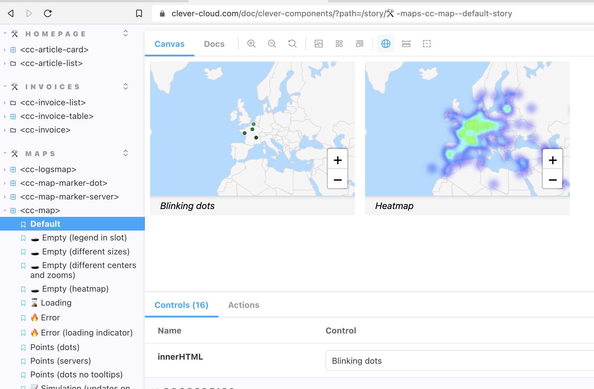
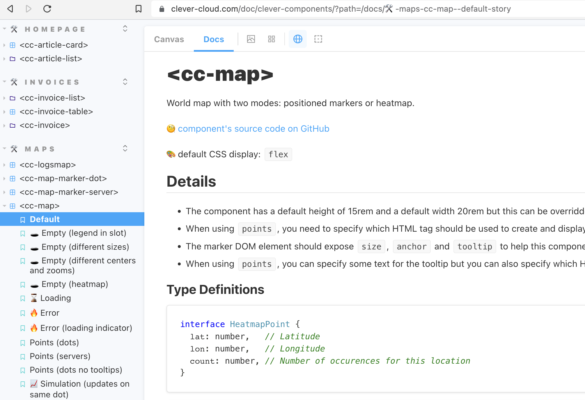

== Design System

* Combines both
** UI component showcase
** Executable Technical Documentation

[.refs]
--

* https://storybook.js.org/[Storybook]

--

=== Design Systems Examples

* Clever Cloud UI Components
* Systeme de design du gouvernement français

[.refs]
--
* https://www.clever-cloud.com/doc/clever-components[Clever Cloud UI Components]
* https://www.systeme-de-design.gouv.fr/[Systeme de design du gouvernement français]
--

=== cc-map

[.refs]
--
* https://www.clever-cloud.com/doc/clever-components/?path=/docs/%F0%9F%9B%A0-maps-cc-map--default-story[Clever Cloud UI Componenents - cc-map ]
--

=== cc-map

[.refs]
--
* https://www.clever-cloud.com/doc/clever-components/?path=/docs/%F0%9F%9B%A0-maps-cc-map--default-story[Clever Cloud UI Componenents - cc-map ]
--