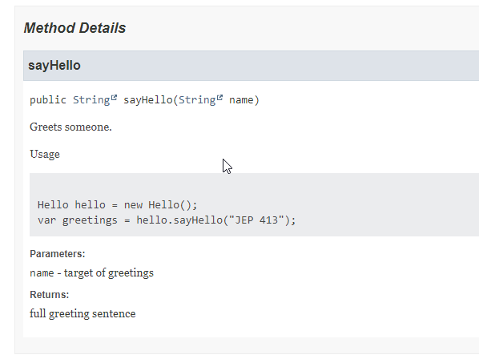

== Java 18 Javadoc Code Snippets

https://openjdk.java.net/jeps/413:[JEP 413 : Code Snippets in Java API Documentation]

=== Input • Production code

Javadoc `@snippet` tag

[.medium]
[source,java]
----
include::../../examples/doctest/executable-javadoc-code-snippets/src/main/java/fr/baldir/samples/hello/Hello.java[]
----

=== Tests

[.small]
[source,java,class=.small]
----
include::../../examples/doctest/executable-javadoc-code-snippets/src/test/java/snippets/SnippetTest.java[]
----

=== Output

[.columns]
=== Qualités

[.column]
--
* Internal documentation
* in-situ
* machine-readable
--

[.column]
--
Attributes

* refactor-friendly
* automated documentation
* low effort
--

[.refs]
--
* https://www.morling.dev/blog/executable-javadoc-code-snippets/
--

[.columns.medium]
=== Attributes

[.column]
--
- 😀 Reliable
- 😀 Low-Effort
- 😐 Collaborative
- 😀 Insightful
--

[.column]
--
* Internal
* Redundant sources reconciliation mechanism
* Audience
** Developers
--

[.notes]
--
* Insightful: if writing doctests is hard it may highlight side effects or complex functions
--

