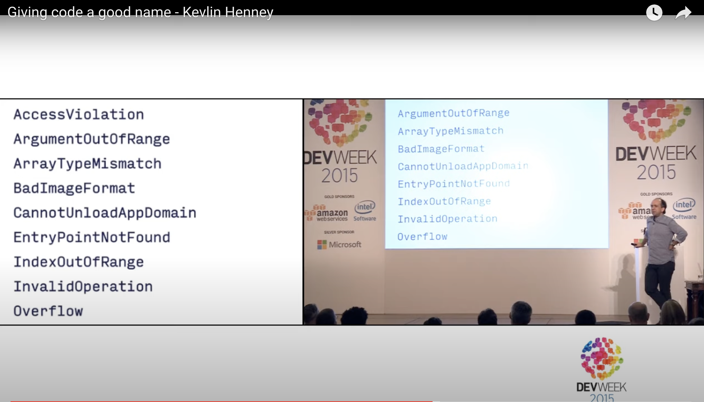

[background-color="#400d43ad"]
== Source Code Itself

[background-color="#400d43ad"]
=== Conventions, Idioms 🥷

* e.g. pep8, zen of python

[source,python]
----
import this
----

[.refs]
--
* https://peps.python.org/pep-0008/
* https://replit.com/languages/python3
--

[background-color="#400d43ad"]
=== ⚠️ Redundant information in naming

[background-color="#400d43ad"]
=== Reduce useless noise

Repeated informations

[.medium]
--
[source,Java]
----
package org.mycompany.worlddestroyer;
/**
* The implementation of the Death Star. <1>
* @author Joe@empire.org <2>
*/
public class DeathStarImpl // <3>
             implements DeathStarInterface // <4>
{}
----
<1> Tells nothing more than the class signature
<2> In internal projet, maybe rely on version control history
<3> Of course it is an implementation
<4> Of course it is an interface
--

[.notes]
--
* `@author` does not encourage collective code ownership
--

[background-color="#400d43ad"]
[.columns]
=== Which is more readable?

[.column]
--
image::assets/kevlin-henney-giving-code-a-good-name-exception.png["Exception class names suffixed with 'Exception'"]
--

[.column]
--

--

[.refs]
--
* https://www.youtube.com/watch?v=CzJ94TMPcD8[Giving code a good name - Kevlin Henney]
--

[background-color="#400d43ad"]
=== Domain Driven Design

* Ubiquitous Language

=== Domain Specific Languages

* Code that reads like prose
* Fluent interfaces

[.refs]
--
* https://martinfowler.com/bliki/FluentInterface.html[Martin Fowler - Fluent Interface]
* https://martinfowler.com/dsl.html[Martin Fowler - DSL]
--